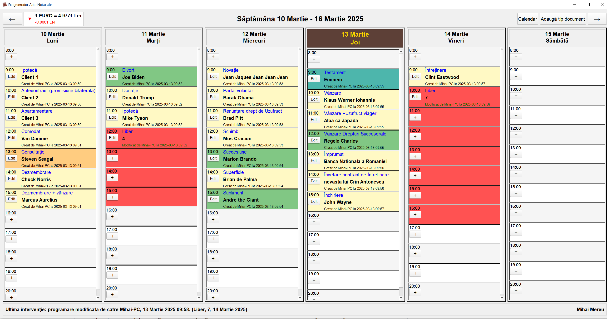

# Programator Acte Notariale

O aplicație desktop pentru gestionarea și programarea actelor notariale, dezvoltată în Python cu PyQt5.

## Descriere

Programator Acte Notariale este o aplicație pentru birouri notariale care permite gestionarea eficientă a programărilor și actelor notariale. Aplicația oferă o interfață intuitivă de tip calendar săptămânal, cu posibilitatea de a adăuga, edita și șterge programări pentru clienți.



## Funcționalități

### Gestionare programări
- **Calendar săptămânal**: Vizualizarea programărilor pe zile și ore
- **Adăugare programări**: Programare rapidă cu specificarea clientului și tipului de document
- **Editare programări**: Posibilitatea de a modifica detaliile unei programări existente
- **Ștergere programări**: Ștergerea programărilor direct din fereastra de editare
- **Programări cu ore flexibile**: Nu doar la ore fixe
- **Evidențierea zilei curente**: Culoare specială pentru ziua curentă

### Sistem avansat de observații
- **Adăugare observații**: Camp dedicat pentru fiecare programare
- **Editare și modificare**: Posibilitatea modificării observațiilor existente
- **Indicatori vizuali**: Programările cu observații sunt semnalate vizual în interfață
- **Istoric complet**: Logging detaliat al tuturor modificărilor aduse observațiilor

### Gestionare avansată a timpului liber
- **Tip de programare "Liber"**: Marcare specială pentru timpul indisponibil
- **Blocare selectivă a intervalelor orare**:
  - Introducerea unui număr (ex: "1", "2", "3") în câmpul client va bloca exact atâtea intervale orare consecutive
  - Lăsarea câmpului gol sau "N/A" va bloca toate intervalele rămase din ziua respectivă
- **Evidențiere vizuală distinctă**: Intervale blocate marcate cu roșu
- **Funcționare inteligentă**: Blocarea se oprește automat la următoarea programare

### Organizare tipuri de documente
- **Gestionare tipuri documente**: Listă configurabilă de tipuri de acte notariale
- **Sistem de culori personalizabile**: 4 culori configurabile pentru diferite tipuri de documente
- **Redenumire facilă**: Redenumire tipuri de documente cu dublu-click
- **Sortare alfabetică**: Ordonare automată alfabetică a tipurilor de documente
- **Actualizare automată**: La redenumirea unui tip de document, toate programările se actualizează

### Navigare și informații
- **Butoane de navigare**: Navigare rapidă între săptămâni (anterior/următor)
- **Dialog calendar**: Salt rapid la orice dată din calendar
- **Curs valutar BNR actualizat automat**:
  - Afișare curs Euro-Lei cu actualizare automată la fiecare oră
  - Indicatori vizuali pentru tendința cursului (crescător/descrescător)
  - Valoare exactă și variație față de cursul anterior
- **Evidențierea modificărilor**: Istoric complet al creării și modificărilor

### Interfață adaptivă și personalizabilă
- **Font mărit**: Vizibilitate optimă pe ecrane de înaltă rezoluție
- **Informare rapidă**: Element de afișare "Ultima intervenție" în timp real
- **Culori configurabile**: Personalizare vizuală pentru diferite tipuri de documente
- **Design intuitiv**: Evidențiere vizuală pentru ziua curentă și ore flexibile

### Securitate și sincronizare
- **Prevenire conflicte**: Blocarea deschiderii simultane a aplicației pe mai multe stații
- **Detecție blocaje vechi**: Auto-detectare și eliminare a blocajelor mai vechi de 4 ore
- **Opțiune de forțare**: Posibilitate de a forța deschiderea în cazuri excepționale

## Sistem de Logging pentru Intervenții

Aplicația include un sistem automat de înregistrare a tuturor intervențiilor (crearea, modificarea și ștergerea programărilor), oferind un istoric complet al activității.

### Caracteristici principale:
- **Organizare lunară**: Fișierele de log sunt generate automat pentru fiecare lună (interventii_YYYY_MM.log)
- **Înregistrare detaliată**: Fiecare acțiune este salvată cu timestamp exact și toate detaliile relevante
- **Logging specializat pentru observații**: Înregistrare dedicată a modificărilor aduse observațiilor
- **Format standardizat**: Înregistrările urmează formatul:
  ```
  [YYYY-MM-DD HH:MM:SS] Ultima intervenție: programare [tip_acțiune] de către [utilizator], [data și ora]. ([tip_act], [nume_client], [data_programare])
  ```
- **Funcționare automată**: Toate intervențiile sunt înregistrate automat, fără a necesita acțiuni suplimentare din partea utilizatorului

### Utilitate:
- Oferă trasabilitate completă a tuturor modificărilor făcute în sistem
- Permite identificarea rapidă a autorului fiecărei modificări
- Facilitează auditarea activității și rezolvarea potențialelor dispute
- Permite recuperarea informațiilor despre programări în caz de necesitate

### Locația fișierelor:
- Fișierele de log sunt salvate în același director cu aplicația și pot fi deschise cu orice editor de text standard pentru consultare.

## Tehnologii utilizate
- **Python 3.x**: Limbajul de programare principal
- **PyQt5**: Framework pentru interfața grafică
- **SQLite**: Bază de date pentru stocarea programărilor
- **JSON**: Format pentru salvarea configurațiilor de tipuri de documente
- **Requests & BeautifulSoup4**: Pentru preluarea cursului valutar BNR

## Instalare

### Pași de instalare
- Pentru utilizatori simpli cu Windows, e suficient sa descarcati fisierul programator.exe si sa il lansati
- Pentru dezvotatori:

```bash
# Clonați repository-ul:
git clone https://github.com/utilizator/programator-acte-notariale.git
cd programator-acte-notariale

# Instalați dependențele:
pip install -r requirements.txt
# sau direct
pip install PyQt5 requests beautifulsoup4

# Rulați aplicația:
python programator.py
```

## Ghid de utilizare

### Navigare în calendar
- Folosiți butoanele ← și → pentru a naviga între săptămâni
- Apăsați butonul Calendar pentru a sări direct la o dată specifică
- Ziua curentă este evidențiată automat cu o culoare distinctivă

### Adăugare programare
- Apăsați butonul + de lângă ora dorită
- Completați detaliile clientului și tipul documentului
- Adăugați observații dacă este necesar
- Apăsați Salvează

### Editare programare
- Apăsați butonul Edit de lângă programarea existentă
- Modificați detaliile necesare
- Apăsați Salvează pentru a confirma modificările sau Șterge programare pentru a elimina programarea

### Utilizarea funcționalităților avansate

#### Blocarea selectivă a timpului
- Creați o programare de tip "Liber"
- Pentru a bloca doar un număr specific de intervale, introduceți numărul dorit în câmpul "Nume client" (ex: "1", "2", "3", etc.)
- Pentru a bloca tot restul zilei, lăsați câmpul gol sau introduceți "N/A"

#### Adăugarea observațiilor
- Folosiți câmpul dedicat din dialog-ul de creare/editare programare
- Modificările în observații sunt înregistrate automat în fișierele de log
- Programările cu observații sunt semnalate vizual în interfață

### Gestionare tipuri de documente
- Apăsați butonul Adaugă tip document
- Selectați culoarea dorită pentru fiecare tip de document din lista de opțiuni
- Pentru redenumire, faceți dublu-click pe numele tipului de document
- Pentru a adăuga un nou tip, completați câmpul și apăsați Adaugă
- Folosiți butonul Configurare Culori pentru a personaliza paleta de culori disponibile
- Apăsați Salvează pentru a confirma modificările

### Utilizare în rețea
- Aplicația detectează automat dacă este deschisă pe altă stație din rețea
- În caz de blocare accidentală, folosiți opțiunea Forțează deschidere

## Structura bazei de date

Aplicația folosește SQLite pentru stocarea datelor în fișierul notarial_scheduler.db. Structura include:
- **Tabelul appointments** - stochează toate programările, inclusiv istoricul de modificări
- **Fișierul document_types.json** - conține configurația pentru tipurile de documente și culorile asociate

## Contribuție

Contribuțiile sunt binevenite! Pentru a contribui la acest proiect:
1. Fork-ați repository-ul
2. Creați un branch nou: `git checkout -b feature/functionalitate-noua`
3. Faceți modificările dorite
4. Commit-ați modificările: `git commit -m 'Adăugare funcționalitate nouă'`
5. Push la branch: `git push origin feature/functionalitate-noua`
6. Creați un Pull Request

## Licență

Acest proiect este freeware

## Autor și Contact

Creat de Mihai Mereu

Pentru întrebări sau sugestii, contactați: mihaimereu97@gmail.com
