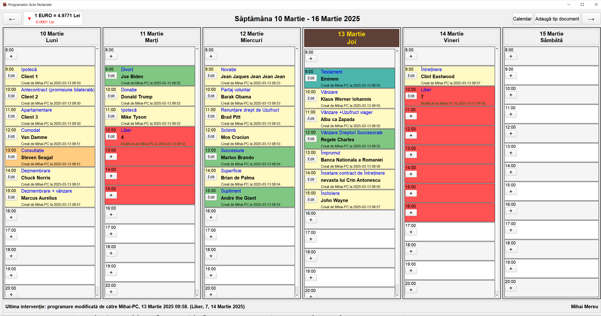

# Programator Acte Notariale

O aplicație desktop pentru gestionarea și programarea actelor notariale, dezvoltată în Python cu PyQt5.

## Descriere

Programator Acte Notariale este o aplicație pentru birouri notariale care permite gestionarea eficientă a programărilor și actelor notariale. Aplicația oferă o interfață intuitivă de tip calendar săptămânal, cu posibilitatea de a adăuga, edita și șterge programări pentru clienți.

## Screenshot aplicație



## Funcționalități

### Gestionare Programări
*   **Calendar săptămânal:** Vizualizarea programărilor pe zile și ore.
*   **Adăugare programări:** Programare rapidă cu specificarea clientului și tipului de document.
*   **Editare programări:** Posibilitatea de a modifica detaliile unei programări existente.
*   **Ștergere programări:** Ștergerea programărilor direct din fereastra de editare.
*   **Programări cu ore flexibile:** Nu doar la ore fixe, ci și la intervale definite de utilizator.
*   **Evidențierea zilei curente:** Culoare specială pentru antetul zilei curente în calendar.

### Sistem Avansat de Observații
*   **Adăugare observații:** Câmp dedicat pentru fiecare programare, permițând note detaliate.
*   **Editare și modificare:** Posibilitatea modificării observațiilor existente.
*   **Indicatori vizuali:** Programările cu observații sunt semnalate vizual în interfață pentru identificare rapidă.
*   **Istoric complet:** Logging detaliat al tuturor modificărilor aduse observațiilor, asigurând trasabilitate.

### Gestionare Avansată a Timpului Liber și Zilelor Nelucrătoare
*   **Tip de programare "Liber":** Marcare specială pentru timpul indisponibil în program.
*   **Blocare selectivă a intervalelor orare:**
    *   Introducerea unui număr (ex: "1", "2", "3") în câmpul client la o programare "Liber" va bloca exact atâtea intervale orare consecutive.
    *   Lăsarea câmpului gol sau introducerea textului "N/A" va bloca toate intervalele rămase din ziua respectivă, până la următoarea programare.
*   **Evidențiere vizuală distinctă:** Intervale blocate marcate cu roșu pentru claritate.
*   **Funcționare inteligentă:** Blocarea timpului liber se oprește automat la următoarea programare programată.
*   **Management zile nelucrătoare (Sărbători Legale):**
    *   Posibilitatea de a marca/demarca zile specifice ca fiind nelucrătoare (ex: sărbători legale) direct din dialogul calendarului.
    *   Zilele marcate ca nelucrătoare sunt evidențiate cu roșu în antetul zilei din calendarul principal.
    *   Zilele de weekend (Sâmbătă, Duminică) sunt implicit considerate nelucrătoare.
    *   Calcul automat al termenelor (ex: preempțiune) luând în considerare zilele lucrătoare.

### Organizare Tipuri de Documente
*   **Gestionare tipuri documente:** Listă configurabilă de tipuri de acte notariale.
*   **Sistem de culori personalizabile:** 4 culori distincte (configurabile de utilizator) ce pot fi asociate diferitelor tipuri de documente pentru evidențiere vizuală.
*   **Redenumire facilă:** Redenumire tipuri de documente cu dublu-click direct din dialogul de gestionare.
*   **Sortare alfabetică:** Ordonare automată alfabetică a listei de tipuri de documente.
*   **Actualizare automată:** La redenumirea unui tip de document, toate programările existente ce foloseau vechiul tip sunt actualizate automat cu noul nume.

### Navigare și Informații
*   **Butoane de navigare:** Navigare rapidă între săptămâni (anterior/următor).
*   **Buton "Azi":** Revenire instantanee la săptămâna curentă.
*   **Dialog calendar:** Salt rapid la orice dată din calendar și managementul zilelor nelucrătoare.
*   **Curs valutar BNR actualizat automat:**
    *   Afișare curs Euro-Lei cu actualizare automată la fiecare oră.
    *   Indicatori vizuali (săgeți și culori) pentru tendința cursului (crescător/descrescător/stabil).
    *   Afișarea valorii exacte a cursului actual și a celui precedent, împreună cu variația numerică.
*   **Evidențierea modificărilor:** Istoric complet al creării, modificărilor și ștergerilor programărilor.

### Interfață Adaptivă și Personalizabilă
*   **Font mărit:** Vizibilitate optimă pe ecrane de înaltă rezoluție pentru o lizibilitate sporită.
*   **Informare rapidă:** Element de afișare "Ultima intervenție" în timp real în partea de jos a ferestrei.
*   **Culori configurabile:** Personalizare vizuală a celor 4 culori disponibile pentru tipurile de documente.
*   **Design intuitiv:** Evidențiere vizuală pentru ziua curentă, zilele nelucrătoare și orele flexibile.
*   **Memorare poziție și dimensiune fereastră:** Aplicația își salvează și restaurează automat ultima poziție și dimensiune, inclusiv starea maximizată, adaptându-se la schimbările de rezoluție ale ecranului.

### Securitate și Sincronizare
*   **Prevenire conflicte:** Blocarea deschiderii simultane a aplicației pe mai multe stații în rețea pentru a evita coruperea datelor.
*   **Detecție blocaje vechi:** Auto-detectare și eliminare automată a fișierelor de blocare (lock files) mai vechi de 4 ore, pentru a preveni blocajele accidentale.
*   **Opțiune de forțare:** Posibilitate de a forța deschiderea aplicației în cazuri excepționale de blocaj persistent, cu avertisment corespunzător.

### Sistem de Logging pentru Intervenții
Aplicația include un sistem automat de înregistrare a tuturor intervențiilor (crearea, modificarea și ștergerea programărilor), oferind un istoric complet al activității.

**Caracteristici principale:**
*   **Organizare lunară:** Fișierele de log sunt generate automat pentru fiecare lună (ex: `interventii_2023_10.log`).
*   **Înregistrare detaliată:** Fiecare acțiune este salvată cu timestamp exact (data și ora), utilizatorul/stația care a efectuat acțiunea și toate detaliile relevante ale programării afectate.
*   **Logging specializat pentru observații:** Înregistrare dedicată și detaliată a oricăror adăugări, modificări sau ștergeri ale textului din câmpul de observații al unei programări.
*   **Format standardizat:** Înregistrările urmează un format clar:
    `[YYYY-MM-DD HH:MM:SS] Ultima intervenție: programare [tip_acțiune] de către [utilizator/stație], [data și ora acțiunii]. ([tip_act], [nume_client], [data_programare])`
*   **Funcționare automată:** Toate intervențiile sunt înregistrate automat, fără a necesita acțiuni suplimentare din partea utilizatorului.

**Utilitate:**
*   Oferă trasabilitate completă a tuturor modificărilor făcute în sistem.
*   Permite identificarea rapidă a autorului fiecărei modificări.
*   Facilitează auditarea activității și rezolvarea potențialelor dispute.
*   Permite recuperarea informațiilor despre programări în caz de necesitate.

**Locația fișierelor:**
*   Fișierele de log sunt salvate în același director cu aplicația și pot fi deschise cu orice editor de text standard pentru consultare.

## Tehnologii Utilizate
*   **Python 3.x:** Limbajul de programare principal.
*   **PyQt5:** Framework pentru interfața grafică (GUI).
*   **SQLite:** Bază de date locală pentru stocarea programărilor și a zilelor nelucrătoare.
*   **JSON:** Format pentru salvarea configurațiilor de tipuri de documente și a setărilor ferestrei.
*   **Requests & BeautifulSoup4:** Biblioteci pentru preluarea și parsarea cursului valutar BNR de pe web.

## Instalare

### Pași de instalare

*   **Pentru utilizatori (Windows):**
    Descărcați fișierul `programator.exe` (dacă este disponibil un executabil compilat) și lansați-l.

*   **Pentru dezvoltatori (sau rulare din sursă):**
    1.  Clonați repository-ul (dacă este disponibil pe o platformă gen GitHub):
        ```bash
        git clone https://github.com/utilizator/programator-acte-notariale.git
        cd programator-acte-notariale
        ```
    2.  Creați un mediu virtual (recomandat):
        ```bash
        python -m venv venv
        # Pe Windows:
        venv\Scripts\activate
        # Pe macOS/Linux:
        source venv/bin/activate
        ```
    3.  Instalați dependențele (dacă există un fișier `requirements.txt`):
        ```bash
        pip install -r requirements.txt
        ```
        Sau instalați manual pachetele necesare:
        ```bash
        pip install PyQt5 requests beautifulsoup4
        ```
    4.  Rulați aplicația:
        ```bash
        python Programator.py
        ```
        (Asigurați-vă că numele fișierului principal este corect, ex: `Programator.py`)

## Ghid de Utilizare

### Navigare în Calendar
*   Folosiți butoanele `←` și `→` pentru a naviga între săptămâni.
*   Apăsați butonul **Azi** pentru a reveni rapid la săptămâna curentă.
*   Apăsați butonul **Calendar** pentru a deschide un selector de date și pentru a sări direct la o săptămână specifică. În acest dialog, puteți de asemenea să marcați/demarcați zilele ca fiind sărbători legale (nelucrătoare) prin click dreapta pe o zi.
*   Ziua curentă în vizualizarea săptămânală este evidențiată automat cu o culoare distinctivă. Zilele nelucrătoare (sărbători legale) au antetul marcat cu roșu.

### Adăugare Programare
1.  Apăsați butonul `+` de lângă ora dorită în coloana zilei corespunzătoare.
2.  În dialogul care apare, completați numele clientului și selectați tipul documentului.
3.  Adăugați observații detaliate în câmpul dedicat, dacă este necesar.
4.  Apăsați **Salvează**.

### Editare Programare
1.  Apăsați butonul **Edit** de lângă programarea existentă pe care doriți să o modificați.
2.  Modificați detaliile necesare (ora, client, tip document, observații).
3.  Apăsați **Salvează** pentru a confirma modificările sau **Șterge programare** pentru a elimina programarea.

### Utilizarea Funcționalităților Avansate

*   **Blocarea Selectivă a Timpului Liber:**
    1.  Creați o programare nouă selectând tipul de document **"Liber"**.
    2.  În câmpul "Nume client":
        *   Pentru a bloca un număr specific de intervale orare (de obicei, de o oră), introduceți numărul dorit (ex: "1", "2", "3").
        *   Pentru a bloca tot restul zilei (până la următoarea programare sau sfârșitul zilei de lucru), lăsați câmpul gol sau introduceți textul "N/A".
    3.  Intervalele blocate vor fi marcate cu roșu.

*   **Adăugarea și Vizualizarea Observațiilor:**
    1.  Folosiți câmpul "Observații" din dialogul de creare/editare a programării.
    2.  Modificările aduse observațiilor sunt înregistrate automat în fișierele de log.
    3.  Programările care conțin observații sunt semnalate vizual în calendar (de obicei, cu o etichetă "Observații" și un tooltip care afișează textul complet la hover).

*   **Gestionare Tipuri de Documente și Culori:**
    1.  Apăsați butonul **Adaugă tip document** din antetul principal.
    2.  În dialogul de gestionare:
        *   Pentru fiecare tip de document existent, puteți selecta o culoare de evidențiere din lista derulantă asociată.
        *   Pentru a redenumi un tip de document, faceți dublu-click pe numele acestuia în listă și introduceți noul nume.
        *   Pentru a adăuga un nou tip de document, introduceți numele în câmpul dedicat din partea de jos, selectați opțional o culoare, și apăsați butonul **Adaugă**.
        *   Folosiți butonul **Configurare Culori** pentru a personaliza codurile HEX și numele celor 4 culori disponibile în sistem.
    3.  Apăsați **Salvează** pentru a confirma toate modificările făcute în acest dialog.

### Utilizare în Rețea
*   Aplicația detectează automat dacă este deja deschisă pe altă stație din rețea care accesează aceeași bază de date partajată.
*   În cazul unui blocaj accidental (ex: aplicația s-a închis incorect pe o altă stație), după 4 ore blocajul este considerat vechi și poate fi eliminat automat.
*   Dacă este necesar, folosiți opțiunea **Forțează deschidere** (cu prudență, deoarece poate duce la conflicte de date dacă aplicația rulează *efectiv* pe altă stație).

## Structura Bazei de Date și Configurații
Aplicația folosește:
*   **`notarial_scheduler.db`:** Un fișier de bază de date SQLite care stochează:
    *   Tabelul `appointments`: Detaliile tuturor programărilor, inclusiv statusul (activ, modificat, șters), timestamp-urile pentru creare/modificare/ștergere, și observațiile.
    *   Tabelul `non_working_days`: Stochează datele marcate manual ca fiind nelucrătoare (sărbători legale).
*   **`document_types.json`:** Un fișier JSON care conține configurația pentru tipurile de documente (lista de nume), culorile personalizate definite de utilizator și asocierile dintre tipurile de documente și aceste culori.
*   **`window_settings.json`:** Un fișier JSON care salvează ultima poziție, dimensiune și stare (maximizată/normală) a ferestrei principale.
*   **`notarial_scheduler.lock`:** Un fișier temporar folosit pentru a preveni deschiderile multiple ale aplicației.
*   **`interventii_YYYY_MM.log`:** Fișiere text lunare care înregistrează toate intervențiile.

## Contribuție
Contribuțiile sunt binevenite! Pentru a contribui la acest proiect:

1.  Fork-ați repository-ul.
2.  Creați un branch nou: `git checkout -b feature/functionalitate-noua`
3.  Faceți modificările dorite.
4.  Commit-ați modificările: `git commit -m 'Adăugare funcționalitate nouă'`
5.  Push la branch: `git push origin feature/functionalitate-noua`
6.  Creați un Pull Request.

## Licență
Acest proiect este freeware.

## Autor și Contact
Creat de Mihai Mereu.

Pentru întrebări sau sugestii, contactați: `mihaimereu97@gmail.com`
